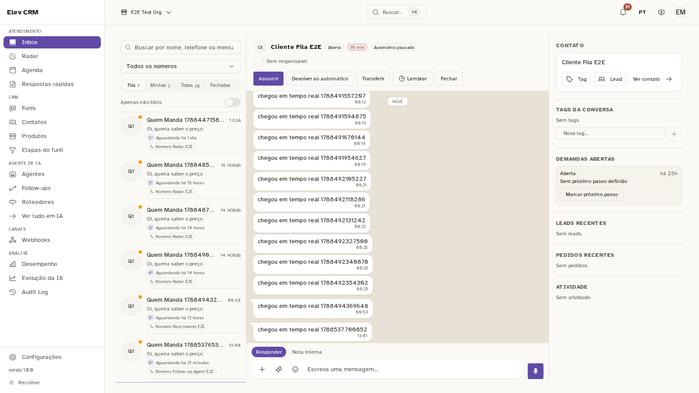
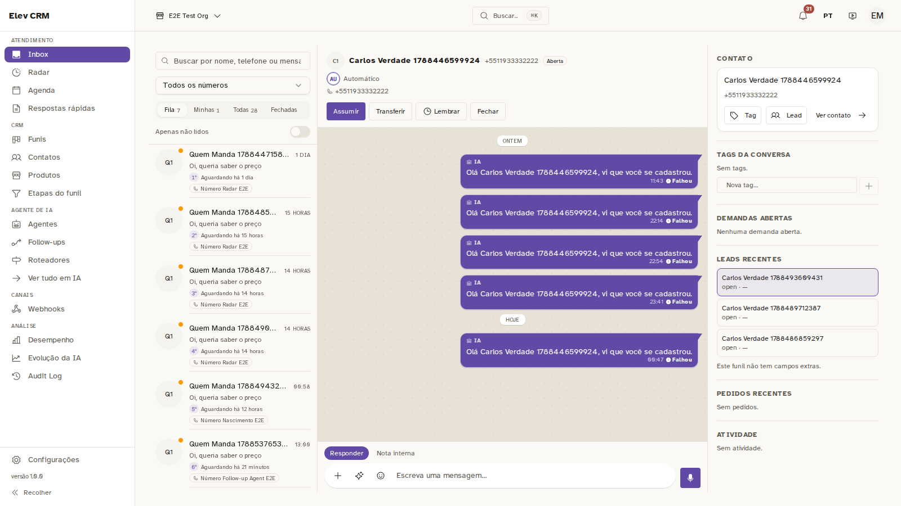
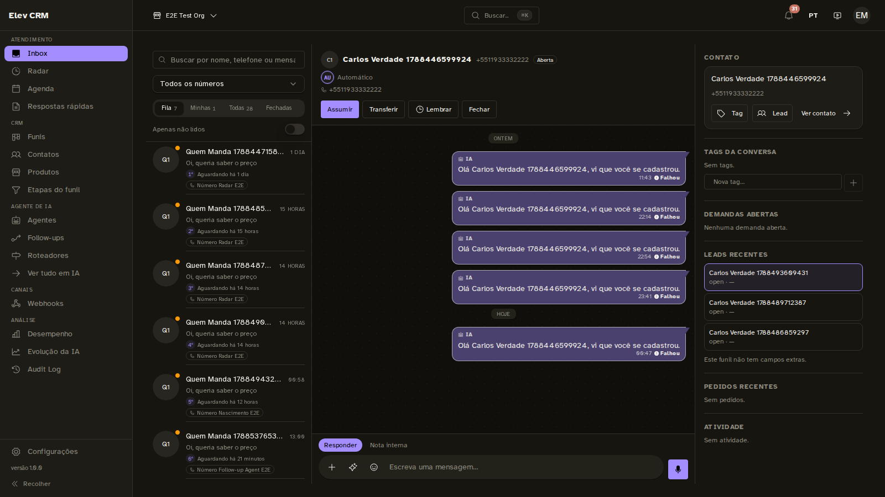

# Inbox com cara de WhatsApp — o que mudou, na tela

Capturas feitas em 2026-09-04, 1600×900, contra o build de produção com o banco
de e2e e **com a marca da instalação aplicada** (`APP_ACCENT_HEX=#7a5cd6`).

> As primeiras capturas deste trabalho saíram VERDES, e a pergunta do dono —
> "por que está verde?" — achou um detalhe que vale registrar: o servidor de
> e2e não recebe `APP_ACCENT_HEX`, e sem cor configurada o produto usa a dele.
> Em produção a variável chega, porque `docker-compose.prod.yml` usa
> `env_file: .env` e o `install.sh` grava a cor lá. Medido subindo o mesmo
> servidor com a variável exportada: o bloco `#marca-instalacao` aparece e
> `--color-accent-500` vira `#7a5cd6`. O objetivo do trabalho está em
[`docs/superpowers/specs/2026-09-04-inbox-cara-de-whatsapp-design.md`](../../docs/superpowers/specs/2026-09-04-inbox-cara-de-whatsapp-design.md).

## Conversa de entrada — o chão, o agrupamento e a lista

As vinte mensagens desta conversa viram **seis blocos**: só a primeira de cada
bloco leva rabinho, e dentro do bloco as bolhas quase se encostam. É o que faz
"o cliente falou seguido" ser lido como um turno de fala em vez de vinte
eventos soltos.

O chão da conversa tem cor e malha próprias — antes era o mesmo fundo do resto
do app, e o olho não separava conversa de formulário.

Na lista, o **nome vem primeiro**. A posição na fila e o tempo de espera desceram
para a faixa de detalhes: o dado continua ali, mas parou de empurrar para baixo
justamente o que se procura numa lista de conversa.

## Conversa de saída — a bolha na cor da marca

A bolha de saída usa `--chat-out`, que deriva de `--color-accent` — a cor que o
revendedor troca em runtime. Pintar de verde WhatsApp apagaria o white-label na
superfície mais vista do produto.

## Tema escuro

No escuro a bolha de saída **escurece mantendo o matiz da marca**
(`color-mix` com o próprio chão da conversa). O valor de `--color-accent` no
tema escuro foi calibrado para botão — peça pequena que precisa saltar. Numa
conversa de trinta linhas a bolha vira metade da tela, e a mesma cor que
funciona num botão vira parede acesa.
